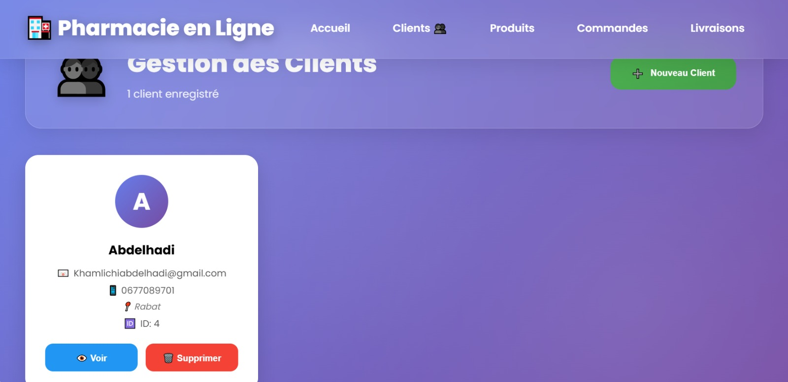
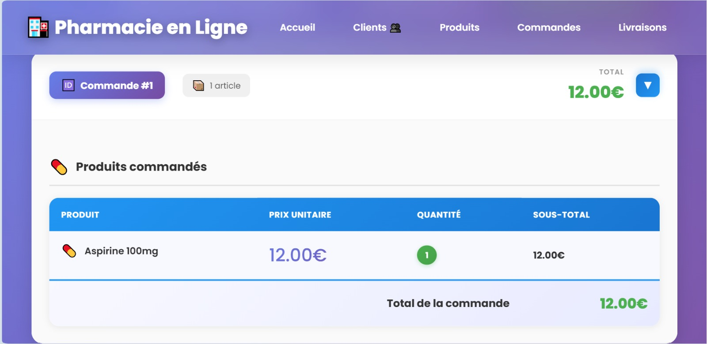
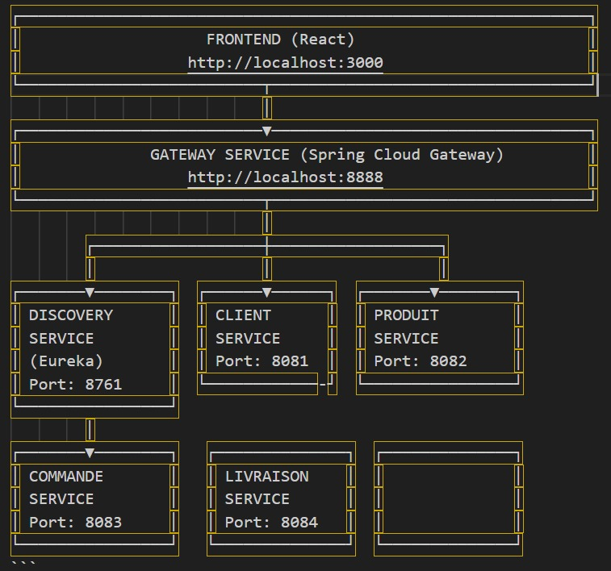
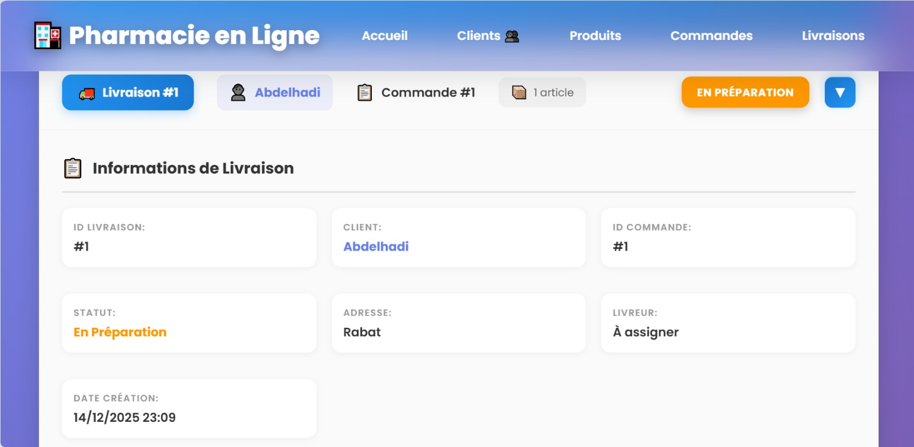
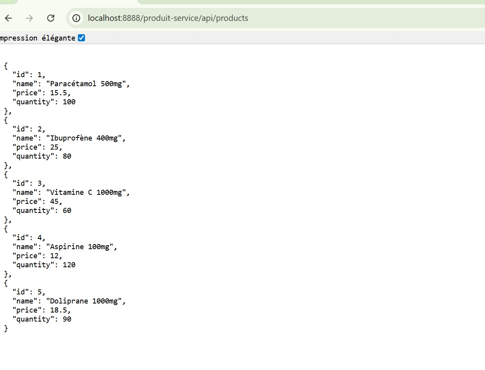
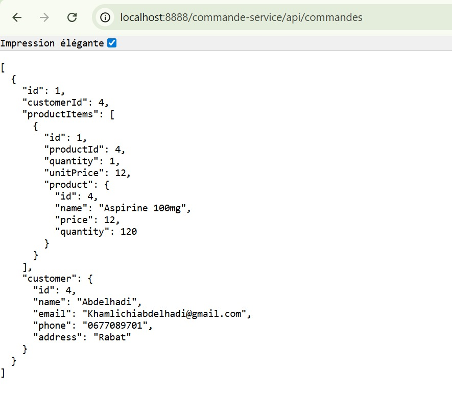
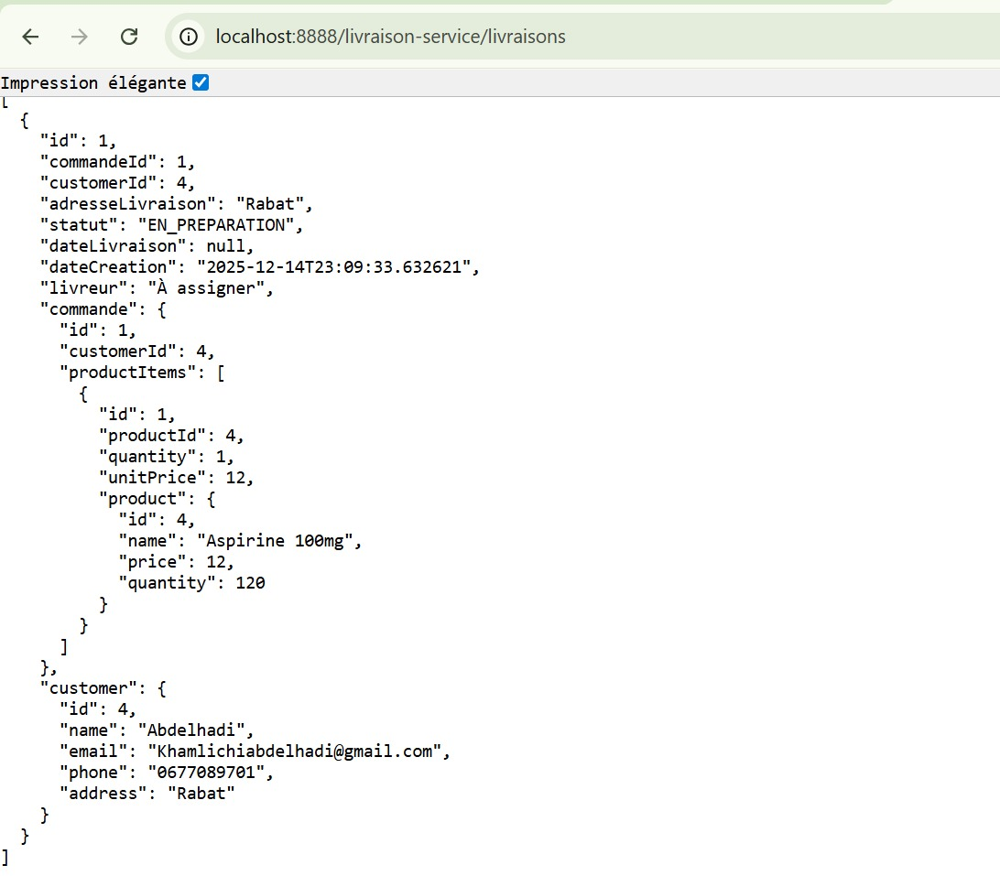
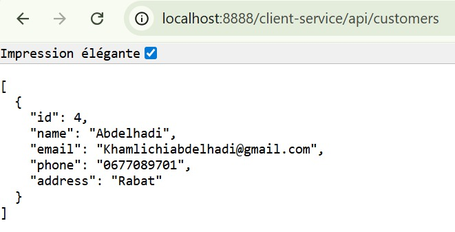
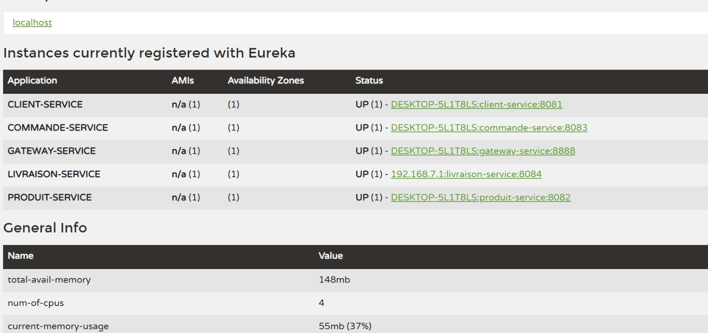

# 💊 Pharmacie en Ligne – Architecture Microservices

## 📌 Description

Ce projet est une **application de gestion de pharmacie en ligne** basée sur une **architecture microservices**.  
Il permet de gérer les **clients**, les **produits pharmaceutiques**, les **commandes** et les **livraisons**, avec une **interface frontend moderne en React** et un backend **Spring Boot / Spring Cloud**.

Le système est conçu pour être **scalable**, **modulaire** et **facilement extensible**.

---

## 🧩 Architecture Générale

L’application suit une architecture **microservices** avec un **API Gateway** et un **service de découverte**.

